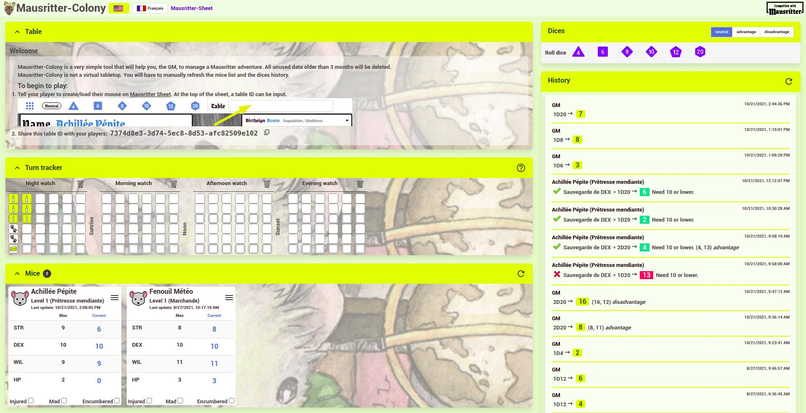

# Welcome to Mausritter Colony 👋

[](https://mausritter.com/third-party-licence/)

> Mausritter Colony offers a very simple tool to manage your Mausritter game.You can count turns, see a summary of your players' mice and track dice rolls. Mausritter Colony is not intended to replace a Virtual Game Table.

**ALPHA VERSION**. It's a work in progress that's not ready to for daily use. — Stay tune ;-)

### 🏠 [Homepage](https://mausritter-colony.dco.ninja)



## Install

```sh
yarn install
```

## Author

👤 **Daniel Coquette**

* Github: [@yar0d](https://github.com/yar0d)

## 🤝 Contributing

Contributions, issues and feature requests are welcome!

Feel free to check [issues page](https://github.com/yar0d/mausritter-colony/issues).

## Show your support

Give a ⭐️ if this project helped you!


## 📝 License

Copyright © 2021 [Daniel Coquette](https://github.com/yar0d).

This project is [Mausritter Third Party Licence](https://mausritter.com/third-party-licence/) licensed.

***
_This README was generated with ❤️ by [readme-md-generator](https://github.com/kefranabg/readme-md-generator)_
